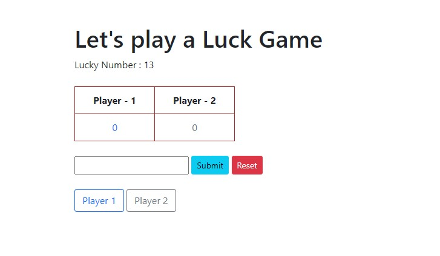

## Rules
 - [x] User will give a number as Input
 - [x] The number will be set to 'Lucky Number'
 - [ ] The 'Lucky Number' won't display in browser (Optional)
 - [x] There will be 2 buttons 'Player 1' & 'Player 2'
 - [x] 'Player 1' button & 'Player 2' button will work simultaneously
 - [x] every time a button is clicked there will be generating a number
 - [x] the player whose point is equal to the lucky number meets first, will be declared as a 'Winner'
 - [x] there will be a 'reset' button, if that's clicked, the game will be reset to a initial stage
